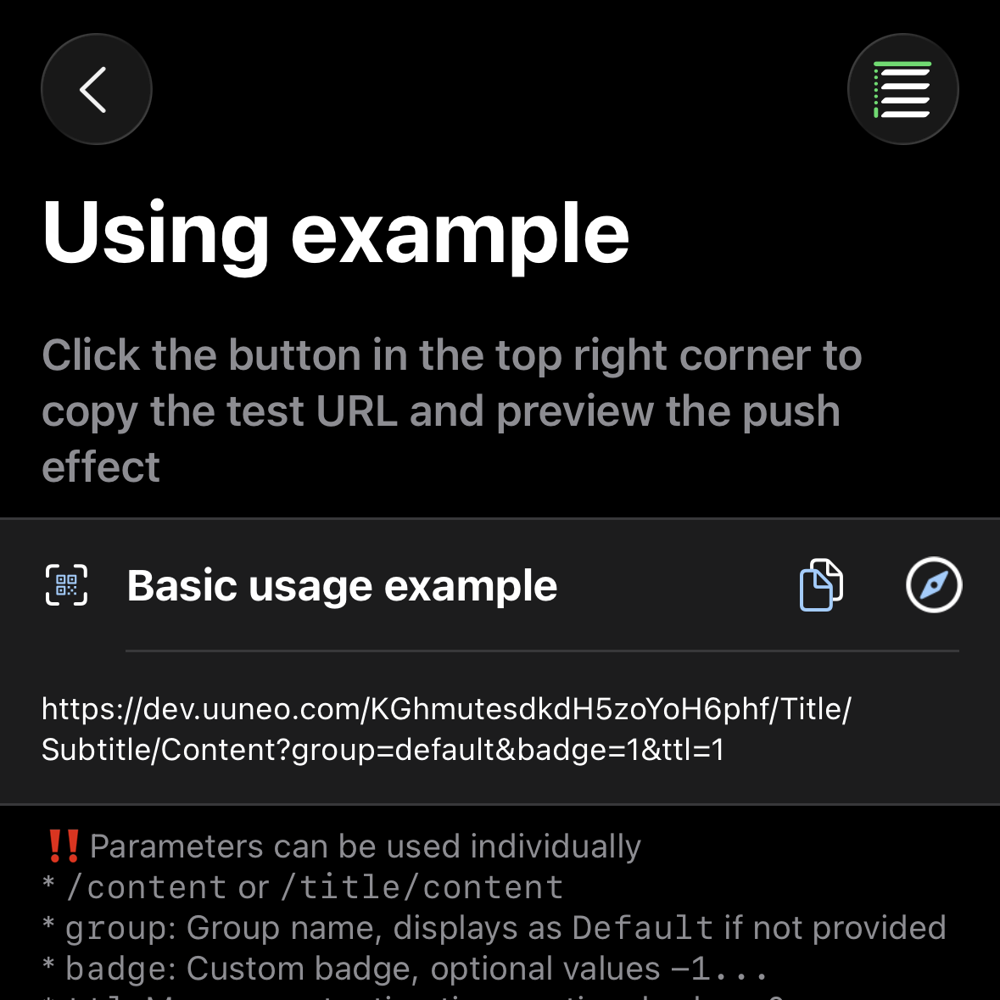

*Thanks to the open source project [BARK](https://github.com/Finb/Bark)*

## Sending Push Notifications 
1. Open the APP and copy the test URL 



2. Modify the content and request this URL.<br>
You can send GET or POST requests. When the request is successful, you will immediately receive a push notification.<br>
Difference from Bark: Parameter priority [POST > GET > URL params] - POST parameters will override GET parameters and so on

## URL Format
The URL consists of a push key, title parameter, and body parameter. There are the following combination methods:

```
https://wzs.app/:key/:body 
https://wzs.app/:key/:title/:body 
https://wzs.app/:key/:title/:subtitle/:body

```

## Request Methods
##### GET request parameters are appended to the URL, for example:
```sh
curl https://wzs.app/your_key/push_content?group=group_name&copy=copy_content
```
*When manually appending parameters to the URL, please be aware of URL encoding issues. You can refer to [FAQ: URL Encoding](/faq?id=%e6%8e%a8%e9%80%81%e7%89%b9%e6%ae%8a%e5%ad%97%e7%ac%a6%e5%af%bc%e8%87%b4%e6%8e%a8%e9%80%81%e5%a4%b1%e8%b4%a5%ef%bc%8c%e6%af%94%e5%a6%82-%e6%8e%a8%e9%80%81%e5%86%85%e5%ae%b9%e5%8c%85%e5%90%ab%e9%93%be%e6%8e%a5%ef%bc%8c%e6%88%96%e6%8e%a8%e9%80%81%e5%bc%82%e5%b8%b8-%e6%af%94%e5%a6%82-%e5%8f%98%e6%88%90%e7%a9%ba%e6%a0%bc)*

##### POST request parameters are placed in the request body, for example:
```sh
curl -X POST https://wzs.app/your_key \
     -d'body=push_content&group=group_name&copy=copy_content'
```
##### POST requests support JSON, for example:
```sh
curl -X "POST" "//https://wzs.app/your_key" \
     -H 'Content-Type: application/json; charset=utf-8' \
     -d $'{
  "body": "Test NoLet Server",
  "title": "Test Title",
  "badge": 1,
  "category": "myNotificationCategory",
  "sound": "minuet.caf",
  "icon": "https://day.app/assets/images/avatar.jpg",
  "group": "test",
  "url": "https://mritd.com"
}'
```

##### For JSON requests, the key can be placed in the request body, and the URL path must be /push, for example:
```sh
curl -X "POST" "https://wzs.app/push" \
     -H 'Content-Type: application/json; charset=utf-8' \
     -d $'{
  "body": "Test NoLet Server",
  "title": "Test Title",
  "device_key": "your_key"
}'
```

## Request Parameters
List of supported parameters. You can preview the specific effects in the APP.
All parameters are compatible with various writing styles: SubTitle / subTitle / subtitle / sub_title / sub-title /

| Parameter | Bark | NoLet Usage Difference |
| ----- | ----------- | ----------- |
| id | None | UUID - passing the same id will override the existing message |
| title | Push notification title | Same |
| subtitle | Push notification subtitle | Same |
| body | Push notification content | Same (also supports content/message/data/text as alternatives to body) |
| markdown | Not supported | Renders Markdown (supports shorthand 'md') |
| level | Push interruption level.<br>**active**: Default value, the system will immediately light up the screen to display the notification<br>**timeSensitive**: Time-sensitive notification, can display notifications in Focus mode.<br>**passive**: Only adds the notification to the notification list, will not light up the screen.<br>**critical**: Important reminder, can remind in Focus mode or silent mode | Compatible. Parameters can be replaced with numbers: `level=1`<br>0: passive<br>1: active<br>2: timeSensitive<br>3...10: critical, in this mode the number will be used for volume (`level=3...10`) |
| volume | Volume in `level=critical` mode, value range 0...10 | Same |
| call | Long reminder, similar to WeChat call notification | Same |
| badge | Push notification badge, can be any number | Calculated based on unread count |
| autoCopy | Automatically copies push content below iOS 14.5, iOS 14.5 and above requires manually long-pressing or pulling down the notification | This app iOS 16+ |
| copy | When copying a push notification, specifies the content to copy. If this parameter is not passed, the entire push content will be copied. | Same |
| sound | Can set different ringtones for push notifications | Default ringtone can be set in the app |
| icon | Set custom icon for push notifications, icons are automatically cached | Same, with additional support for uploading cloud icons |
| image | Pass in an image URL, the phone will automatically download and cache the image after receiving the message | Same |
| savealbum | Not supported | Pass "1" to automatically save the image to the photo album |
| group | Group messages, push notifications will be displayed in the notification center grouped by `group`.<br>You can also choose to view different groups in the message history list. | Compatible |
| isArchive | Pass `1` to save the push, pass anything else to not save the push, don't pass to decide whether to save based on the App settings. | Use `ttl=days` |
| url | URL to jump to when clicking the push notification, supports URL Scheme and Universal Link | Same |
