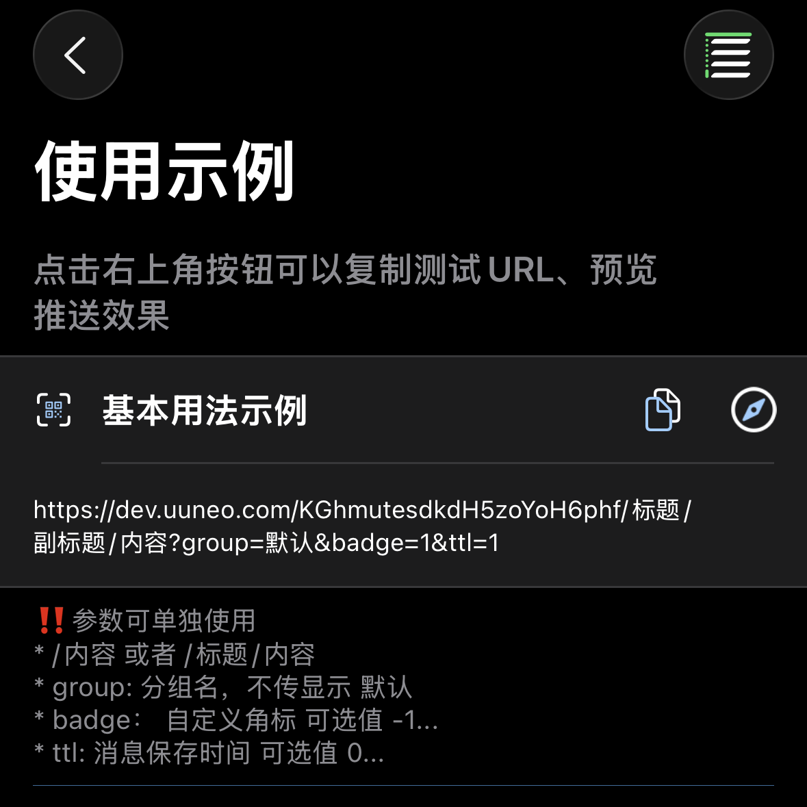

*[BARK](https://github.com/Finb/Bark) のオープンソースプロジェクトに感謝いたします*

## プッシュ通知の送信 
1. アプリを開き、テストURLをコピーします



2. 内容を変更し、このURLにリクエストを送信します。<br>
GETまたはPOSTリクエストを送信でき、リクエストが成功すると即座にプッシュ通知を受信します <br>
barkとの違い：パラメータの優先順位 【POST > GET > URL params】 postパラメータがgetパラメータを上書きします

## URL形式
URLはプッシュkey、パラメータtitle、パラメータbodyで構成されます。以下の2つの組み合わせ方法があります

```
https://wzs.app/:key/:body 
https://wzs.app/:key/:title/:body 
https://wzs.app/:key/:title/:subtitle/:body

```

## リクエスト方法
##### GETリクエストのパラメータをURLの後に連結、例：
```sh
curl https://wzs.app/your_key/プッシュ内容?group=グループ&copy=コピー
```
*手動でパラメータをURLに連結する際は、URLエンコーディングの問題にご注意ください。[よくある質問：URLエンコーディング](/faq?id=%e6%8e%a8%e9%80%81%e7%89%b9%e6%ae%8a%e5%ad%97%e7%ac%a6%e5%af%bc%e8%87%b4%e6%8e%a8%e9%80%81%e5%a4%b1%e8%b4%a5%ef%bc%8c%e6%af%94%e5%a6%82-%e6%8e%a8%e9%80%81%e5%86%85%e5%ae%b9%e5%8c%85%e5%90%ab%e9%93%be%e6%8e%a5%ef%bc%8c%e6%88%96%e6%8e%a8%e9%80%81%e5%bc%82%e5%b8%b8-%e6%af%94%e5%a6%82-%e5%8f%98%e6%88%90%e7%a9%ba%e6%a0%bc)をご参照ください*

##### POSTリクエストのパラメータをリクエストボディに含める、例：
```sh
curl -X POST https://wzs.app/your_key \
     -d'body=プッシュ内容&group=グループ&copy=コピー'
```
##### POSTリクエストはJSONをサポート、例：
```sh
curl -X "POST" "//https://wzs.app/your_key" \
     -H 'Content-Type: application/json; charset=utf-8' \
     -d $'{
  "body": "Test NoLet Server",
  "title": "Test Title",
  "badge": 1,
  "category": "myNotificationCategory",
  "sound": "minuet.caf",
  "icon": "https://day.app/assets/images/avatar.jpg",
  "group": "test",
  "url": "https://mritd.com"
}'
```

##### JSONリクエストでkeyをリクエストボディに含めることができ、URLパスは/pushである必要があります、例
```sh
curl -X "POST" "https://wzs.app/push" \
     -H 'Content-Type: application/json; charset=utf-8' \
     -d $'{
  "body": "Test NoLet Server",
  "title": "Test Title",
  "device_key": "your_key"
}'
```

## 全パラメータリスト
サポートされているパラメータリストで、具体的な効果はアプリ内でプレビューできます。
すべてのパラメータは様々な記法に対応：SubTitle / subTitle / subtitle / sub_title / sub-title /

| パラメータ | パラメータタイプ | 使用説明 |
| ----- | ----------- | ----------- |
| id | 文字列 | UUID 同じidを渡すと既存のメッセージを上書き、idのみを渡すとメッセージを削除 |
| title | 文字列 | プッシュタイトル |
| subtitle | 文字列 | プッシュサブタイトル |
| body | 文字列 | プッシュ内容（content/message/data/textはbodyと同等） |
| cipherText | 文字列 | 暗号化されたプッシュ内容 |
| cipherNumber | 整数 | `cipherNumber=0` 暗号化キー番号、0はシステムデフォルトキー |
| markdown | 文字列 | Markdown記法（省略形mdをサポート） |
| level | 文字列または整数  | プッシュ中断レベル。<br>**active**：デフォルト値、システムが即座に画面を点灯して通知を表示<br>**timeSensitive**：時間に敏感な通知、集中モードでも通知を表示可能<br>**passive**：通知リストにのみ追加し、画面を点灯しない<br>**critical**：重要な通知、集中モードやサイレントモードでも通知。数字で代替可能：`level=1`<br>0：passive<br>1：active<br>2：timeSensitive<br>3...10：critical、このモードでは数字が音量として使用される（`level=3...10`） |
| volume | 整数/文字列 | `level=critical&volume=5` モードでの音量、範囲0...10 |
| call | 文字列 | `call=1` 長い通知、WeChatの電話通知に類似 |
| badge | 文字列  | `badge=1` プッシュバッジ、任意の数字が可能 |
| autoCopy | ブール値 | `autoCopy=1` または `autoCopy=true` プッシュを手動で長押しまたは下にスワイプする必要がある |
| copy | 文字列 | `copy=コピー内容` プッシュをコピーする際に指定された内容をコピー、このパラメータを渡さない場合は全体のプッシュ内容をコピー |
| sound | 文字列 | `sound=minuet` プッシュに異なる着信音を設定可能、アプリ内でデフォルト着信音を設定可能 |
| icon | URL | `icon=https://example.com/icon.png` カスタムアイコンを設定、アイコンは自動キャッシュ、クラウドアイコンのアップロードをサポート |
| icon | emoji | `icon=🐲`   |
| icon | 文字列配列 | `icon=グループ,ff0000`  |
| image | URL | 画像アドレスを渡すと、携帯電話がメッセージを受信後に自動でダウンロードしてキャッシュ |
| savealbum | ブール値 | "1"を渡すと画像をアルバムに自動保存 |
| group | 文字列 | メッセージをグループ化し、プッシュが`group`ごとに通知センターにグループ表示されます。<br>履歴メッセージリストでも異なるグループを選択して表示できます。 |
| ttl | 整数/文字列 | `ttl=日数` プッシュ有効期限、単位は日、デフォルトはアプリ内設定 |
| url | URL  | プッシュをクリックした際にジャンプするURL、URL SchemeとUniversal Linkをサポート |
