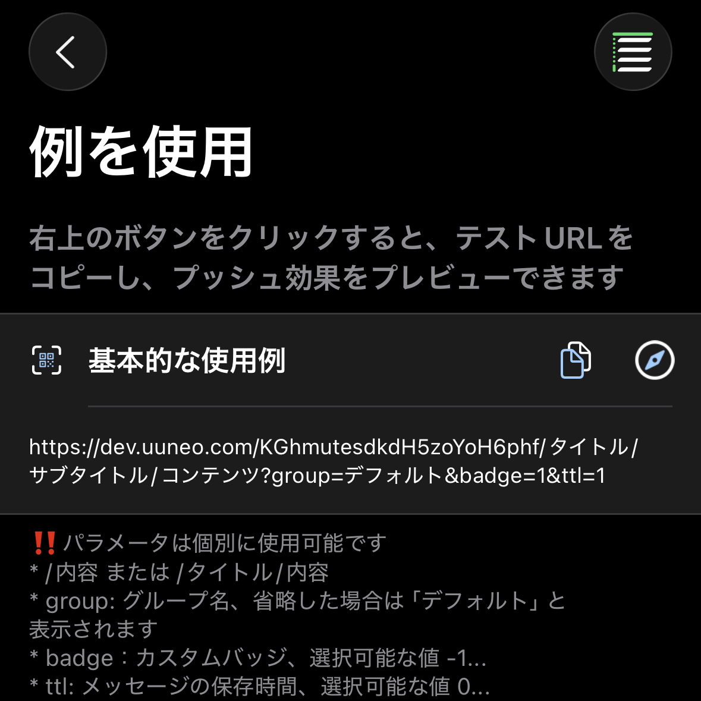

*[BARK](https://github.com/Finb/Bark)のオープンソースプロジェクトに感謝します*

## プッシュ通知の送信 
1. APPを開き、テストURLをコピーします 



2. 内容を修正し、このURLにリクエストを送信します。<br>
GETまたはPOSTリクエストを送信でき、リクエストが成功すると即座にプッシュ通知を受信します <br>
Barkとの違い：パラメータの優先順位 【POST > GET > URL params】 POSTパラメータはGETパラメータを上書きします（以下同様）

## URL形式
URLはプッシュキー、titleパラメータ、bodyパラメータで構成されています。以下の組み合わせ方法があります

```
https://wzs.app/:key/:body 
https://wzs.app/:key/:title/:body 
https://wzs.app/:key/:title/:subtitle/:body

```

## リクエスト方法
##### GETリクエストのパラメータはURLの後ろに追加します、例：
```sh
curl https://wzs.app/your_key/プッシュ内容?group=グループ&copy=コピー
```
*手動でパラメータをURLに追加する場合は、URLエンコーディングの問題に注意してください。[よくある質問：URLエンコーディング](/faq?id=%e6%8e%a8%e9%80%81%e7%89%b9%e6%ae%8a%e5%ad%97%e7%ac%a6%e5%af%bc%e8%87%b4%e6%8e%a8%e9%80%81%e5%a4%b1%e8%b4%a5%ef%bc%8c%e6%af%94%e5%a6%82-%e6%8e%a8%e9%80%81%e5%86%85%e5%ae%b9%e5%8c%85%e5%90%ab%e9%93%be%e6%8e%a5%ef%bc%8c%e6%88%96%e6%8e%a8%e9%80%81%e5%bc%82%e5%b8%b8-%e6%af%94%e5%a6%82-%e5%8f%98%e6%88%90%e7%a9%ba%e6%a0%bc)を参照してください*

##### POSTリクエストのパラメータはリクエストボディに配置します、例：
```sh
curl -X POST https://wzs.app/your_key \
     -d'body=推送内容&group=分组&copy=复制'
```
##### POST 请求支持JSON，例如：
```sh
curl -X "POST" "//https://wzs.app/your_key" \
     -H 'Content-Type: application/json; charset=utf-8' \
     -d $'{
  "body": "Test NoLet Server",
  "title": "Test Title",
  "badge": 1,
  "category": "myNotificationCategory",
  "sound": "minuet.caf",
  "icon": "https://day.app/assets/images/avatar.jpg",
  "group": "test",
  "url": "https://mritd.com"
}'
```

##### JSON 请求 key 可以放进请求体中,URL 路径须为 /push，例如
```sh
curl -X "POST" "https://wzs.app/push" \
     -H 'Content-Type: application/json; charset=utf-8' \
     -d $'{
  "body": "Test NoLet Server",
  "title": "Test Title",
  "device_key": "your_key"
}'
```

## 请求参数
支持的参数列表，具体效果可在APP内预览。
所有参数兼容各种写法：SubTitle / subTitle / subtitle / sub_title / sub-title /

| 参数 | Bark | NoLet 使用差异 |
| ----- | ----------- | ----------- |
| id | 无 | UUID 传入相同id覆盖原有消息 |
| title | 推送标题 | 一致 |
| subtitle | 推送副标题 | 一致 |
| body | 推送内容 | 一致( 支持 content/message/data/text 等同body) |
| markdown | 不支持 | 渲染Markdown(支持简写 md) |
| level | 推送中断级别。<br>**active**：默认值，系统会立即亮屏显示通知<br>**timeSensitive**：时效性通知，可在专注状态下显示通知。<br>**passive**：仅将通知添加到通知列表，不会亮屏提醒。<br>**critical**：重要提醒，可在专注模式或者静音模式下提醒 | 兼容。参数可以使用数字替代：`level=1`<br>0：passive<br>1：active<br>2：timeSensitive<br>3...10：critical，此模式数字将用于音量（`level=3...10`） |
| volume | `level=critical` 模式下音量，取值范围 0...10 | 一致 |
| call | 长提醒，类似微信电话通知 | 一致 |
| badge | 推送角标，可以是任意数字 | 按照未读数计算 |
| autoCopy | iOS 14.5 以下自动复制推送内容，iOS 14.5 以上需手动长按推送或下拉推送 | 本应用 iOS 16+ |
| copy | 复制推送时，指定复制的内容，不传此参数将复制整个推送内容。 | 一致 |
| sound | 可以为推送设置不同的铃声 | 应用内可设置默认铃声 |
| icon | 为推送设置自定义图标,图标自动缓存 | 一致，额外支持上传云图标 |
| image | 传入图片地址，手机收到消息后自动下载缓存 | 一致 |
| savealbum | 不支持 | 传"1"自动保存图片到相册 |
| group | 对消息进行分组，推送将按 `group` 分组显示在通知中心中。<br>也可在历史消息列表中选择查看不同的群组。 | 兼容 |
| isArchive | 传 `1` 保存推送，传其他的不保存推送，不传按 App 内设置来决定是否保存。 | 用 `ttl=天数` |
| url | 点击推送时，跳转的 URL，支持 URL Scheme 和 Universal Link | 一致 |
