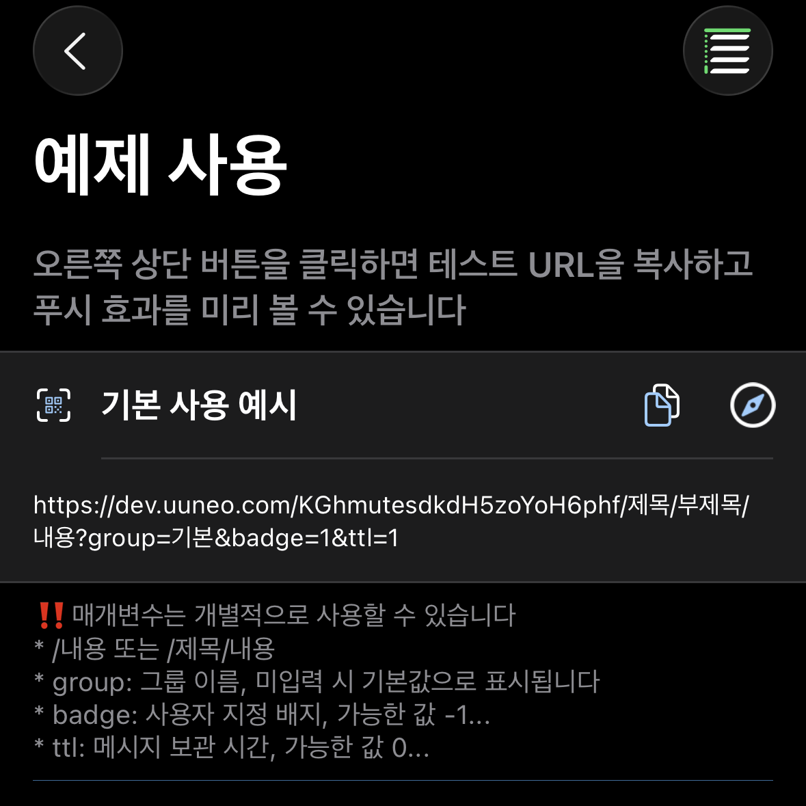

*[BARK](https://github.com/Finb/Bark)의 오픈 소스 프로젝트에 감사드립니다*

## 푸시 알림 보내기 
1. 앱을 열고 테스트 URL을 복사합니다 



2. 내용을 수정하고 이 URL로 요청합니다.<br>
GET 또는 POST 요청을 보낼 수 있으며, 요청이 성공하면 즉시 푸시 알림을 받습니다 <br>
Bark와의 차이점: 매개변수 우선순위 【POST > GET > URL params 】 post 매개변수는 get 매개변수를 덮어쓰는 식입니다

## URL 형식
URL은 푸시 키, title 매개변수, body 매개변수로 구성됩니다. 다음과 같은 조합 방식이 있습니다

```
https://wzs.app/:key/:body 
https://wzs.app/:key/:title/:body 
https://wzs.app/:key/:title/:subtitle/:body

```

## 요청 방법
##### GET 요청 매개변수는 URL 뒤에 추가됩니다. 예:
```sh
curl https://wzs.app/your_key/푸시내용?group=그룹&copy=복사
```
*URL에 매개변수를 수동으로 추가할 때는 URL 인코딩 문제에 주의하세요. [자주 묻는 질문: URL 인코딩](/faq?id=%e6%8e%a8%e9%80%81%e7%89%b9%e6%ae%8a%e5%ad%97%e7%ac%a6%e5%af%bc%e8%87%b4%e6%8e%a8%e9%80%81%e5%a4%b1%e8%b4%a5%ef%bc%8c%e6%af%94%e5%a6%82-%e6%8e%a8%e9%80%81%e5%86%85%e5%ae%b9%e5%8c%85%e5%90%ab%e9%93%be%e6%8e%a5%ef%bc%8c%e6%88%96%e6%8e%a8%e9%80%81%e5%bc%82%e5%b8%b8-%e6%af%94%e5%a6%82-%e5%8f%98%e6%88%90%e7%a9%ba%e6%a0%bc)을 참조하세요*

##### POST 요청 매개변수는 요청 본문에 포함됩니다. 예:
```sh
curl -X POST https://wzs.app/your_key \
     -d'body=푸시내용&group=그룹&copy=복사'
```
##### POST 요청은 JSON을 지원합니다. 예:
```sh
curl -X "POST" "//https://wzs.app/your_key" \
     -H 'Content-Type: application/json; charset=utf-8' \
     -d $'{
  "body": "Test NoLet Server",
  "title": "Test Title",
  "badge": 1,
  "category": "myNotificationCategory",
  "sound": "minuet.caf",
  "icon": "https://day.app/assets/images/avatar.jpg",
  "group": "test",
  "url": "https://mritd.com"
}'
```

##### JSON 요청에서 키는 요청 본문에 포함할 수 있으며, URL 경로는 /push여야 합니다. 예:
```sh
curl -X "POST" "https://wzs.app/push" \
     -H 'Content-Type: application/json; charset=utf-8' \
     -d $'{
  "body": "Test NoLet Server",
  "title": "Test Title",
  "device_key": "your_key"
}'
```

## 요청 매개변수
지원되는 매개변수 목록입니다. 구체적인 효과는 앱 내에서 미리 볼 수 있습니다.
모든 매개변수는 다양한 표기법을 지원합니다: SubTitle / subTitle / subtitle / sub_title / sub-title /

| 매개변수 | Bark | NoLet 사용 차이점 |
| ----- | ----------- | ----------- |
| id | 없음 | UUID 동일한 id를 전달하면 기존 메시지를 덮어씁니다 |
| title | 푸시 제목 | 동일 |
| subtitle | 푸시 부제목 | 동일 |
| body | 푸시 내용 | 동일(content/message/data/text 등도 body와 동일하게 지원) |
| markdown | 지원하지 않음 | 마크다운 렌더링(md로 간략하게 표기 가능) |
| level | 푸시 중단 레벨.<br>**active**: 기본값, 시스템이 즉시 화면을 켜고 알림을 표시합니다<br>**timeSensitive**: 시간에 민감한 알림, 집중 모드에서도 알림을 표시할 수 있습니다.<br>**passive**: 알림 목록에만 알림을 추가하고 화면을 켜지 않습니다.<br>**critical**: 중요한 알림, 집중 모드나 무음 모드에서도 알림을 표시합니다 | 호환됨. 매개변수는 숫자로 대체할 수 있습니다: `level=1`<br>0: passive<br>1: active<br>2: timeSensitive<br>3...10: critical, 이 모드에서 숫자는 볼륨으로 사용됩니다(`level=3...10`) |
| volume | `level=critical` 모드에서의 볼륨, 범위는 0...10 | 동일 |
| call | 긴 알림, 위챗 전화 알림과 유사 | 동일 |
| badge | 푸시 배지, 임의의 숫자가 될 수 있음 | 읽지 않은 수에 따라 계산 |
| autoCopy | iOS 14.5 이하에서는 푸시 내용을 자동으로 복사, iOS 14.5 이상에서는 푸시를 길게 누르거나 아래로 당겨야 함 | 이 앱은 iOS 16+ |
| copy | 푸시를 복사할 때 지정된 내용을 복사합니다. 이 매개변수가 없으면 전체 푸시 내용을 복사합니다. | 동일 |
| sound | 푸시에 다른 벨소리를 설정할 수 있음 | 앱 내에서 기본 벨소리 설정 가능 |
| icon | 푸시에 사용자 정의 아이콘 설정, 아이콘은 자동으로 캐시됨 | 동일, 추가로 클라우드 아이콘 업로드 지원 |
| image | 이미지 주소를 전달하면 휴대폰이 메시지를 받은 후 자동으로 다운로드하여 캐시 | 동일 |
| savealbum | 지원하지 않음 | "1"을 전달하면 이미지를 자동으로 앨범에 저장 |
| group | 메시지를 그룹화하여 알림 센터에 `group`별로 표시됩니다.<br>또한 기록 메시지 목록에서 다른 그룹을 선택하여 볼 수 있습니다. | 호환됨 |
| isArchive | `1`을 전달하면 푸시를 저장하고, 다른 값을 전달하면 저장하지 않으며, 전달하지 않으면 앱 내 설정에 따라 저장 여부가 결정됩니다. | `ttl=일수` 사용 |
| url | 푸시를 클릭할 때 이동할 URL, URL Scheme 및 Universal Link 지원 | 동일 |
