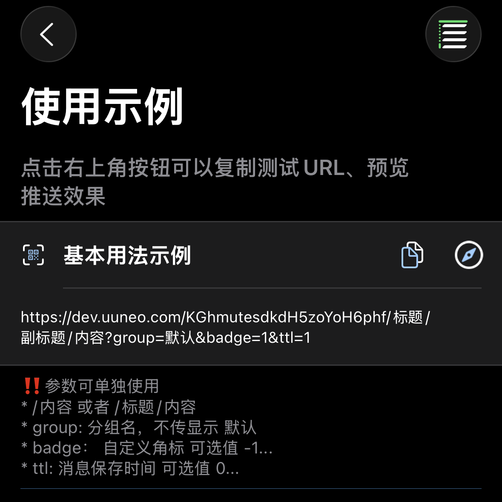

*[BARK](https://github.com/Finb/Bark) 오픈소스 프로젝트에 감사드립니다*

## 푸시 전송 
1. 앱을 열고 테스트 URL을 복사합니다



2. 내용을 수정하고 이 URL로 요청합니다.<br>
GET 또는 POST 요청을 보낼 수 있으며, 요청이 성공하면 즉시 푸시를 받게 됩니다 <br>
bark와의 차이점: 매개변수 우선순위 【POST > GET > URL params】 post 매개변수가 get 매개변수를 덮어쓰는 방식입니다

## URL 형식
URL은 푸시 key, 매개변수 title, 매개변수 body로 구성됩니다. 다음과 같은 두 가지 조합 방식이 있습니다

```
https://wzs.app/:key/:body 
https://wzs.app/:key/:title/:body 
https://wzs.app/:key/:title/:subtitle/:body

```

## 요청 방식
##### GET 요청 매개변수를 URL 뒤에 연결, 예시:
```sh
curl https://wzs.app/your_key/푸시내용?group=그룹&copy=복사
```
*수동으로 매개변수를 URL에 연결할 때는 URL 인코딩 문제에 주의하세요. [자주 묻는 질문: URL 인코딩](/faq?id=%e6%8e%a8%e9%80%81%e7%89%b9%e6%ae%8a%e5%ad%97%e7%ac%a6%e5%af%bc%e8%87%b4%e6%8e%a8%e9%80%81%e5%a4%b1%e8%b4%a5%ef%bc%8c%e6%af%94%e5%a6%82-%e6%8e%a8%e9%80%81%e5%86%85%e5%ae%b9%e5%8c%85%e5%90%ab%e9%93%be%e6%8e%a5%ef%bc%8c%e6%88%96%e6%8e%a8%e9%80%81%e5%bc%82%e5%b8%b8-%e6%af%94%e5%a6%82-%e5%8f%98%e6%88%90%e7%a9%ba%e6%a0%bc)을 참고하세요*

##### POST 요청 매개변수를 요청 본문에 포함, 예시:
```sh
curl -X POST https://wzs.app/your_key \
     -d'body=푸시내용&group=그룹&copy=복사'
```
##### POST 요청은 JSON을 지원, 예시:
```sh
curl -X "POST" "//https://wzs.app/your_key" \
     -H 'Content-Type: application/json; charset=utf-8' \
     -d $'{
  "body": "Test NoLet Server",
  "title": "Test Title",
  "badge": 1,
  "category": "myNotificationCategory",
  "sound": "minuet.caf",
  "icon": "https://day.app/assets/images/avatar.jpg",
  "group": "test",
  "url": "https://mritd.com"
}'
```

##### JSON 요청에서 key를 요청 본문에 포함할 수 있으며, URL 경로는 /push여야 합니다, 예시
```sh
curl -X "POST" "https://wzs.app/push" \
     -H 'Content-Type: application/json; charset=utf-8' \
     -d $'{
  "body": "Test NoLet Server",
  "title": "Test Title",
  "device_key": "your_key"
}'
```

## 모든 매개변수 목록
지원되는 매개변수 목록으로, 구체적인 효과는 앱 내에서 미리 볼 수 있습니다.
모든 매개변수는 다양한 표기법과 호환됩니다: SubTitle / subTitle / subtitle / sub_title / sub-title /

| 매개변수 | 매개변수 타입 | 사용 설명 |
| ----- | ----------- | ----------- |
| id | 문자열 | UUID 동일한 id를 전달하면 기존 메시지를 덮어쓰고, id만 전달하면 메시지를 삭제합니다 |
| title | 문자열 | 푸시 제목 |
| subtitle | 문자열 | 푸시 부제목 |
| body | 문자열 | 푸시 내용 (content/message/data/text는 body와 동일) |
| cipherText | 문자열 | 암호화된 푸시 내용 |
| cipherNumber | 정수 | `cipherNumber=0` 암호화 키 번호, 0은 시스템 기본 키 |
| markdown | 문자열 | Markdown 문법 (줄임말 md 지원) |
| level | 문자열 또는 정수  | 푸시 중단 레벨.<br>**active**: 기본값, 시스템이 즉시 화면을 켜고 알림을 표시<br>**timeSensitive**: 시간에 민감한 알림, 집중 모드에서도 알림 표시 가능<br>**passive**: 알림 목록에만 추가하고 화면을 켜지 않음<br>**critical**: 중요 알림, 집중 모드나 무음 모드에서도 알림. 숫자로 대체 가능: `level=1`<br>0: passive<br>1: active<br>2: timeSensitive<br>3...10: critical, 이 모드에서 숫자는 볼륨으로 사용됨 (`level=3...10`) |
| volume | 정수/문자열 | `level=critical&volume=5` 모드에서 볼륨, 범위 0...10 |
| call | 문자열 | `call=1` 긴 알림, 위챗 전화 알림과 유사 |
| badge | 문자열  | `badge=1` 푸시 배지, 임의의 숫자 가능 |
| autoCopy | 불린값 | `autoCopy=1` 또는 `autoCopy=true` 푸시를 수동으로 길게 누르거나 아래로 당겨야 함 |
| copy | 문자열 | `copy=복사내용` 푸시 복사 시 지정된 내용을 복사, 이 매개변수를 전달하지 않으면 전체 푸시 내용을 복사 |
| sound | 문자열 | `sound=minuet` 푸시에 다른 벨소리 설정 가능, 앱 내에서 기본 벨소리 설정 가능 |
| icon | URL | `icon=https://example.com/icon.png` 사용자 정의 아이콘 설정, 아이콘 자동 캐시, 클라우드 아이콘 업로드 지원 |
| icon | emoji | `icon=🐲`   |
| icon | 문자열 배열 | `icon=그룹,ff0000`  |
| image | URL | 이미지 주소 전달, 휴대폰이 메시지를 받은 후 자동으로 다운로드하여 캐시 |
| savealbum | 불린값 | "1" 전달 시 이미지를 앨범에 자동 저장 |
| group | 문자열 | 메시지를 그룹화하여 푸시가 `group`별로 알림 센터에 그룹으로 표시됩니다.<br>기록 메시지 목록에서도 다른 그룹을 선택하여 볼 수 있습니다. |
| ttl | 정수/문자열 | `ttl=일수` 푸시 만료 시간, 단위는 일, 기본값은 앱 내 설정 |
| url | URL  | 푸시 클릭 시 이동할 URL, URL Scheme 및 Universal Link 지원 |
